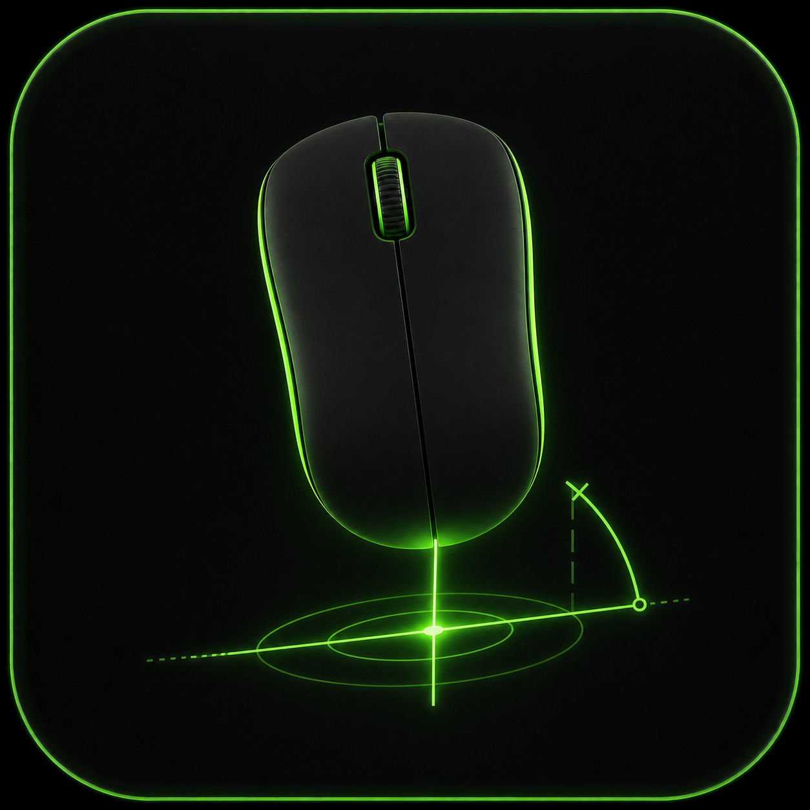

<p align="center">
  
</p>

# Mouse Rotation Tuner

Check whether your natural mouse swipes are actually horizontal. Inspired by [Razer Mouse Rotation Calibration](https://www.razer.com/eu-en/technology/mouse-rotation-tool), this version goes further with cleaner measurements and better repeatability. The latest build is available in [Releases](https://github.com/kostya1F634/mouse-rotation-tuner/releases/tag/v1.1.1).

## Features

- Real-time filtering that removes near-vertical movement and large arcs from the angle calculation.
- A quality score based on path noise and rejected motion.
- Confidence scoring based on swipe length, noise, rejected motion, and segment agreement.
- Segment diagnostics for the start, middle, and end of each swipe.
- Speed profile analysis with low, medium, and high-speed angle snapshots.
- Series statistics with mean, median, spread, stability, trimmed mean, and best-three average.
- Fast repeat-and-review workflow for collecting only usable measurements.


## Source Launch
Requirements:

- [`uv`](https://docs.astral.sh/uv/)

Preferred way:

```bash
make run
```

Without `make`:

```bash
uv run main.py
```

## Desktop Builds

```bash
make build-linux
make build-windows
```

## License

MIT. See [LICENSE](LICENSE).
